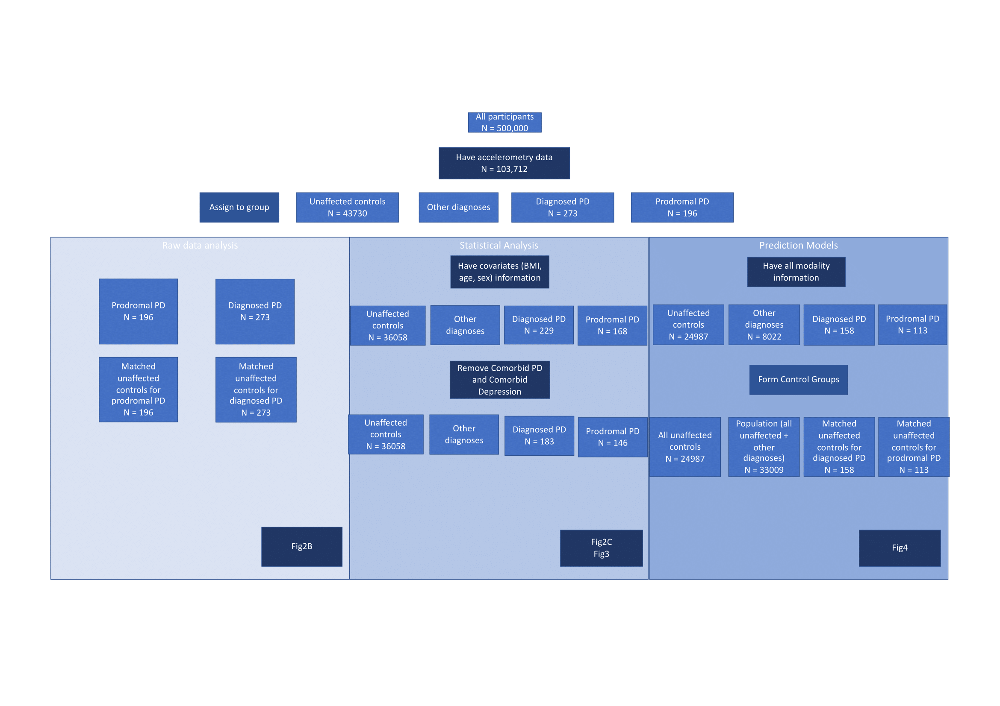
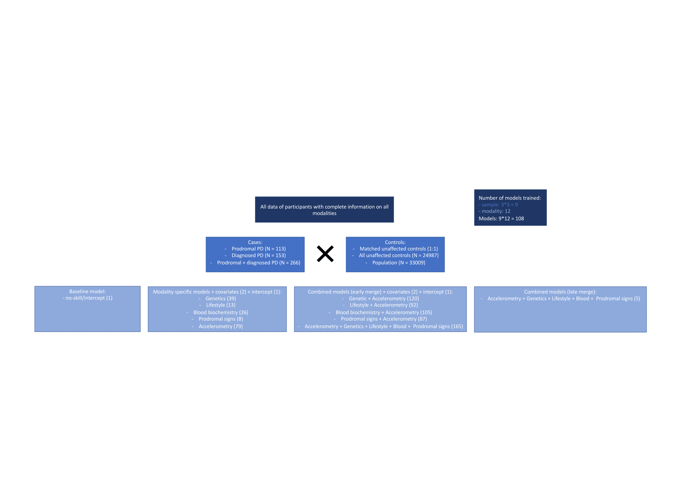

# Wearable devices identify Parkinson’s disease up to 7 years before clinical diagnosis

This repository contains all the code necessary to replicate the analysis presented in the Nature Medicine article:
Wearable movement-tracking data identify Parkinson’s disease years before clinical diagnosis, Schalkamp et al., 2023 (https://doi.org/10.1038/s41591-023-02440-2)

also available as a pre-print on medRxiv:
Wearable devices can identify Parkinson’s disease up to 7 years before clinical diagnosis, Schalkamp et al., 2022 (https://doi.org/10.1101/2022.11.28.22282809)

## Requirements

All major packages are listed in envionment/requirements.txt but the conda environment is also provided in env.yml. Most analyses are carried out under env.yml, but the accelerometer data processing requires the accelerometer.yml environment and deriving the statistical tests relies on pythonstats.yml. Data extraction from UK Biobank relies on a customised version of the ukbb_parser package (https://github.com/aschalkamp/ukbb_parser) and processing of the accelerometry data uses the biobankAccelerometerAnalysis package (https://github.com/OxWearables/biobankAccelerometerAnalysis). The sksurvauprc environments implements the dynamic area under the precision recall curve for survival models extending the sksurv package (https://github.com/aschalkamp/scikit-survival/tree/auprc).

## Folder Structure

Resources contains information on UKBB specific clinical codes and field codes as well as utilities to handle the data.
Analyses contains all relevent scripts and notebooks from extracting and preprocessing the data to running the models.
Make_figures contains notebooks to remake all figures included in the paper as well as extracting the relevant supplemental table information.

## Overview of Methods

We aim to explore prodromal biomarkers for Parkinson's disease by performing a retrospective analysis on the UK Biobank data. We show that digital biomarkers extracted from 1-week accelerometry data performs better at identifying prodromal cases from the general population than any other tested modality (genetics, blood biochemistry, lifestyle, known prodromal symptoms). 

We do so by first exploring the raw data, then performing statistical analysis on extracted accelerometry features to assess specificity on a group-level, and finally perform machine-learning to evaluate the individual-level predictions in different control group settings.

For the prediction models we train lasso logistic regression models on various modalities and their combinations using different control groups. First, a matched setting where healthy controls are matched to each case, then using all unaffected controls, and finally using a representation of the general population.

